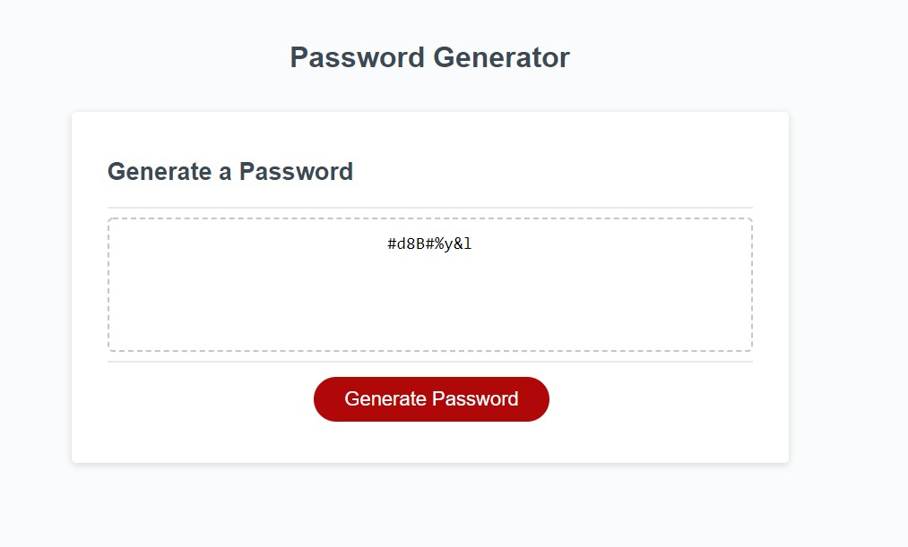

# Password Generator

Rudementary password generator using window allerts, prompts, and confirms.

## Built With

* [HTML](https://developer.mozilla.org/en-US/docs/Web/HTML)
* [CSS](https://developer.mozilla.org/en-US/docs/Web/CSS)
* [Javascript](https://developer.mozilla.org/en-US/docs/Web/JavaScript)

## Deployed Link

* [See Live Site](https://divinemayura.github.io/password-generator/)

## Repo Link

* [Repository](https://github.com/DivineMayura/password-generator)

## Authors

* **May Faucher** 

- [Link to Portfolio Site](https://divinemayura.github.io/)
- [Link to Github](https://github.com/DivineMayura)
- [Link to LinkedIn](www.linkedin.com/in/mayfaucher)

## License

This project is licensed under the MIT License 

## Image of Deployed Site

